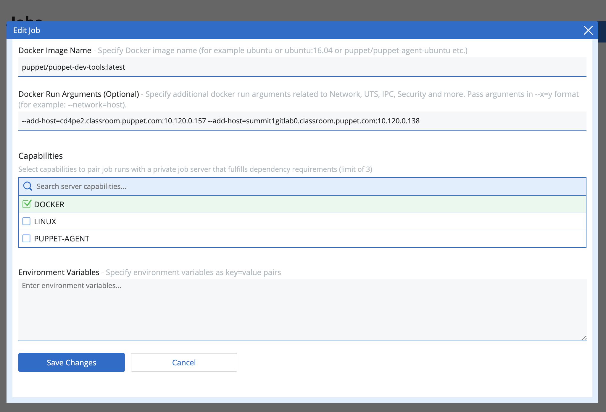

# Add a master pipeline to the control repository

Once you have a control repository configured for your workspace, you can add pipelines to automatically validate and deploy code in response to events in your VCS.  (A webhook was automatically added for you, when you integrated the control repository into your workspace.)

You will add two pipelines to your control repository.  The first is a "master" pipeline, which is triggered when either there is a push to the master branch, a pull request into your master branch, or a pull request is merged.

CD4PE manipulates branches that correspond to environments, much like you are used to doing already.  Before it can manipulate them, you'll need to create them.  At a customer you'll need to make sure they exist, in order to add them to a pipeline.  We've already created these branches for you, in the workshop.

## Do this

First let's create the pipeline.

1. Log in to the CD4PE GUI
1. If you're not already there, click "Control Repos" on the left-hand side, then click your control repository.
1. Click "Manage pipelines"
1. Put a checkmark by the "PullRequest" trigger
1. Click "Save Settings" and then "Done"
1. Click "+ Add default pipeline"
1. Between the validation and impact analysis change, click the "All Succeeded" menu and change it to "All Completed"
1. Development deployment
    1. Click to "Add a deployment"
    1. In "Select a node group," pick "Development environment"
    1. In "Select a deployment policy," pick "Eventual consistency policy"
    1. Leave the timeout at sixty seconds
    1. Click to "Add deployment to stage"
    1. Click "Done" to dismiss the dialog
    1. Check the "auto promote" checkbox between the Pull Request Gate and the Deployment stage
1. Staging deployment
    1. Click to "Add stage"
    1. For "Stage name" supply something like "Staging deployment"
    1. For "Select a node group," choose "Staging environment"
    1. For "Select a deployment policy," pick "Direct deployment policy"
    1. Click to "Add stage"
    1. Click "Done"
1. Production deployment
    1. Click to "Add stage"
    1. For "Stage name" supply something like "Production deployment"
    1. For "Select a node group," choose "Production environment"
    1. For "Select a deployment policy," pick "Eventual consistency policy"
    1. Click to "Add stage"
    1. Click "Done"

Next let's make sure it works when we push something to the master branch.

1. Switch to your SSH connection to your summitXcd4peY.classroom.puppet.com node
1. Change directories into your control repository (we cloned it for you)
    * `cd control-repo`
1. Make extra sure you're up to date with what's in GitLab
    * `git pull origin master`
1. Make a fake, empty commit
    * `git commit -m 'Empty commit for master pipeline' --allow-empty`
1. Push it up, triggering the webhook, and kicking off the pipeline
    * `git push origin master`
1. Switch back to the CD4PE GUI
1. Click the "New Events" button when it appears
1. Click the blue chevron in the right corner of the event, to expand it
1. First, the built-in validation jobs will run and report success/failure.
    1. This might take a minute or two, it's launching docker containers to do it
1. They should all pass, and the pipeline will auto promote to the next stage
1. The Impact Analysis stage should now kick-in
    1. Give it a minute, it's doing a lot of work.
    1. If you click the "#x" link just under "Impact Analysis Running" it shows more detail
1. Since this is a push, and not a Pull Request, the PR Gate will not stop the pipeline at this stage
1. And since we checked "auto promote" the code should now be automatically deployed to the Development environment
    1. Wait for the deployment job to finish
1. Once Development is deployed, click the "Promote" button between the Development and Staging deployments
    1. Wait for the deployment job to finish, as before
1. Click the "Promote" button between the Staging and Production stages
1. Your code is now live in all of your environments!

## Discussion questions

* Thinking of your own customers, how might they react to the vastly increased velocity and automated roll-out that CD4PE introduces into the environment?
* What sort of conversations will you have about the ability to auto promote code to, say, the development environment if all tests succeed?


## For the curious

* On the CD4PE host, if you tail `/var/log/messages`, you can watch what it's doing on a lower level than the GUI.
* On the master, you can tail `/var/log/puppetlabs/puppetserver/puppetserver.log` to watch the Code Manager's side of the conversation.

## Troubleshooting
If DNS is not setup in your lab environment, at this point your jobs may be failing with an error similar to:

```shell
2020-02-24T22:48:05Z started 'distelli' with pid 27187
Identity added: (stdin) ((stdin))
Cloning into '/distelli/tasks/d3-8/repo'...
HEAD is now at 33e4874 Empty commit for master pipeline
latest: Pulling from puppet/puppet-dev-tools
Digest: sha256:ac843616bf600b648e873543c6a6609dcc109559ed33ca5f858beac69ea8c52f
Status: Image is up to date for puppet/puppet-dev-tools:latest
docker.io/puppet/puppet-dev-tools:latest
Installing gosu (https://github.com/tianon/gosu/releases/download/1.9/gosu-amd64)
curl: (6) Could not resolve host: cd4pe2.classroom.puppet.com; Unknown error
Failed to install 'distelli' command from 'http://cd4pe2.classroom.puppet.com:8080/download/client'
Failed to initialize specified -vm (5 minutes)
```

The containers running our jobs need to be able to resolve:
* The Gitlab instance (summitYgitlab0.classroom.puppet.com)
* The CD4PE instance (cd4peX.classroom.puppet.com)

To get this information, from your CD4PE instance run the following commands:
* `grep 'add-host cd4pe' /usr/local/bin/docker-run-cd4pe-start.sh | tr -d '\\'`
* `ping -c 1 summitYgitlab0.classroom.puppet.com`

Edit **EACH** job in the CD4PE GUI to add the following *Docker Run Arguments*:

`--add-host=cd4pe2.classroom.puppet.com:10.120.0.157 --add-host=summit1gitlab0.classroom.puppet.com:10.120.0.138`

**NOTE:** Don't copy and paste this into your lab. Use the output from the above commands to get the correct hosts for your lab environment.


